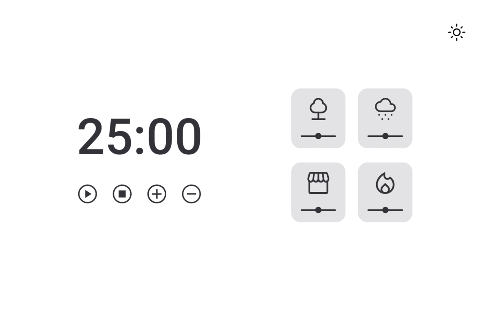

# Rocketseat Explorer - Stage 05 Module 03

Digital timer project.

The concepts used in this project:

- ES6 Modules;
- Modulation;
- Refactoring;
- Factory pattern

[Click here to acess](https://buucocs.github.io/expl-stg5-mdl3-projeto_solo/)

## Technology

- HTML
- CSS
- javaScript
- Git and Github

## Contact

- contato@leonardohgomes.com.br
- @leonardohgomes_
- https://github.com/Buucocs